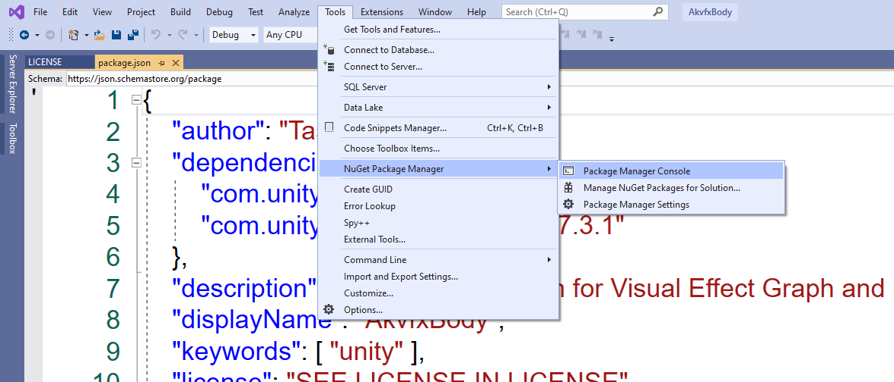
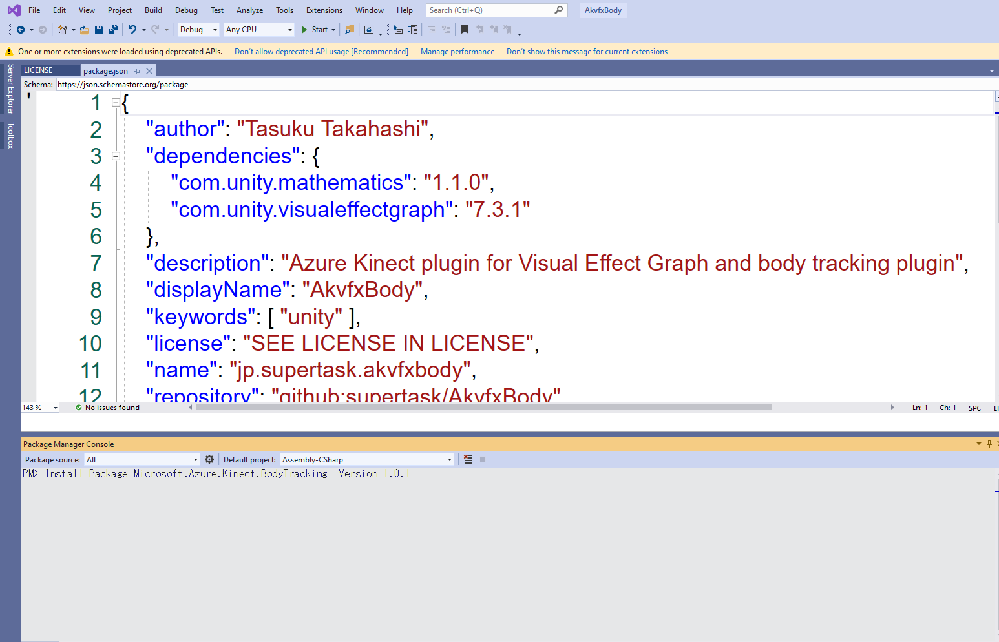
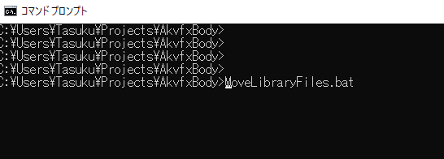

Akvfx
=====


**Akvfx** is a Unity plugin that captures color/depth data from an [Azure
Kinect] device and converts them into attribute maps (textures) handy for using
with [Visual Effect Graph].


## How to install
### 1. Download and install the latest Azure Kinect SDK (msi or nuget).
https://github.com/microsoft/Azure-Kinect-Sensor-SDK/blob/develop/docs/usage.md

### 2. Download and install the latest Azure Kinect Body Tracking SDK (msi or nuget).
https://docs.microsoft.com/en-us/azure/kinect-dk/body-sdk-download

### 3. Install packages from Nuget

In Visual Studio of your project:

```
Tools -> Select Tools -> NuGet Package Manager-> Package Manager Console
```



Execute a command bellow
```
Install-Package Microsoft.Azure.Kinect.BodyTracking -Version 1.0.1
```



### 4. Execute MoveLibraryFiles.bat in current directory.

Execute a command bellow on Command Prompt.
```
MoveLibraryFiles.bat
```




System Requirements
-------------------

- Unity 2019.3
- Azure Kinect DK

See also the [System Requirements] page of Azure Kinect DK. Note that Akvfx
doesn't support Linux at the moment.

[System Requirements]:
    https://docs.microsoft.com/en-us/azure/kinect-dk/system-requirements

## Acknowledgment
- Keijiro Takahashi, [Akvfx](https://github.com/keijiro/Akvfx)
- Keijiro Takahashi, [NoiseBall4](https://github.com/keijiro/NoiseBall4)
- Microsoft, [Body tracking samples for Unity](https://github.com/microsoft/Azure-Kinect-Samples/tree/master/body-tracking-samples/sample_unity_bodytracking)


